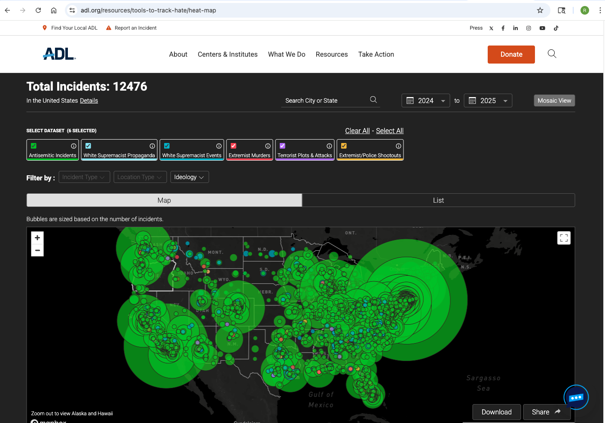
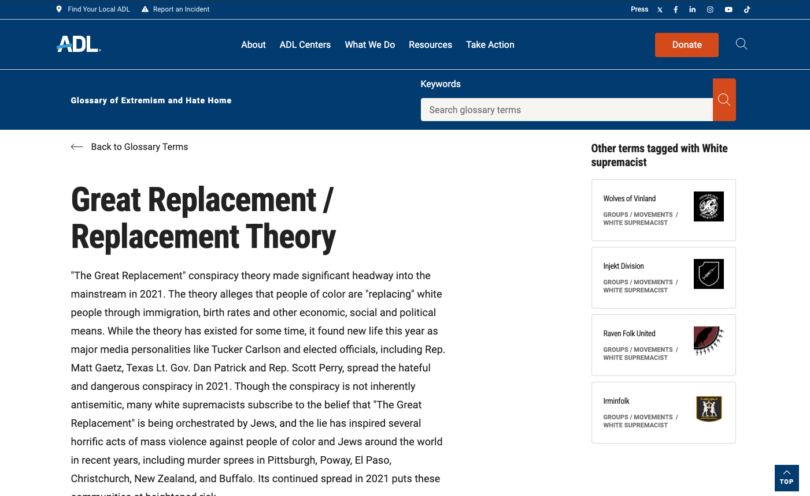

```{r setup, include=FALSE}
knitr::opts_chunk$set(echo = FALSE, warning = FALSE, message = FALSE)

library(tidyverse)
library(jsonlite)
library(knitr)
library(kableExtra)
library(DiagrammeR)
```

## The Original Vision {.build}

**Initial Research Goal**

<div style="font-size: 20px;line-height: 1.3">
This project originally set out to evaluate whether **relational context** improves the classification of hate terminology compared to traditional text-only approaches.

Specifically:

- Use ADL's **expert-vetted incident database** as high-quality ground truth
- Compare **flat text classification** against a **graph-enhanced semantic model**
- Test whether contextual relationships improve:
  - Classification accuracy
  - Disambiguation of coded or ambiguous terms
  - Interpretability of results

The working hypothesis was that **meaning in hate speech is relational**, not purely lexical — and that models ignoring context would underperform.
</div>

<div class="notes">
This was not “ML for ML’s sake” — it was a hypothesis-driven comparison between flat and relational representations.
</div>
## ADL HEAT Map: Real-Time Hate Tracking {.build}

::: {style="display: flex; align-items: flex-start; gap: 25px;"}

::: {style="flex: 1; font-size: 18px; line-height: 1.4;"}

**What It Is:**
- **H**ate, **E**xtremism, **A**ntisemitism, **T**errorism Map
- Interactive tool tracking incidents in real-time across the U.S.

**Data Categories Tracked:**
- Antisemitic Incidents (harassment, vandalism, assault)
- White Supremacist Propaganda & Events
- Extremist Murders & Terrorist Plots

**Current Scale:** 12,476 incidents (2024-2025)

**Our Value Add:**
- HEAT shows **WHERE** and **WHEN**
- We add **WHAT TYPE** (23 granular categories)
- Enables faster triage and targeted response

**Explore:** [adl.org/heat-map](https://www.adl.org/resources/tools-to-track-hate/heat-map)

:::

::: {style="flex: 0 0 350px;"}

:::

:::
## ADL Glossary of Extremism and Hate {.build}

::: {style="display: flex; align-items: flex-start; gap: 25px;"}

::: {style="flex: 1; font-size: 18px; line-height: 1.4;"}

**What It Is:**
- Comprehensive database of hate terminology, symbols, and extremist movements
- Expert-curated definitions with context, ideology, and severity ratings

**Content Coverage:**
- 1,142+ terms across 23 categories
- Groups/Movements, Numbers/Symbols, Slogans/Code Words
- Conspiracy Theories, Publications, Tactics

**Our Use:**
- **Foundation** of the knowledge graph
- Each term becomes a node with rich semantic context
- Incident descriptions matched against glossary via embeddings
- Enables granular classification vs. broad "hate" labels

**Explore:** [adl.org/resources/hate-symbols](https://www.adl.org/resources/hate-symbols/search)

:::

::: {style="flex: 0 0 350px;"}

:::

:::


## The Pivot: A Critical Realization {.build}

As implementation progressed, a more fundamental issue emerged:

**Accuracy was not the bottleneck — scalability and generalization were.**

```{r load-data}
incidents <- read_csv("output/structured_incidents.csv", show_col_types = FALSE)
glossary  <- read_csv("data/processed/glossary_final.csv", show_col_types = FALSE)

n_glossary  <- nrow(glossary)
n_incidents <- nrow(incidents)

incidents_formatted <- format(n_incidents, big.mark = ",")
```

### The Scale Problem

::: {style="font-size: 22px; margin-top: 20px;"}
| Resource            | Nature           | Current Scale                  |
| ------------------- | ---------------- | ------------------------------ |
| ADL Incident Labels | Expert-reviewed  | Stable, high quality           |
| ADL Glossary Terms  | Manually curated | `r n_glossary` terms           |
| New Hate Incidents  | Rapidly evolving | `r incidents_formatted` / year |
:::

<div class="centered" style="margin-top: 25px; font-size: 26px; color: #d9534f;">
**The glossary evolves linearly — incidents evolve exponentially**
</div>

## What Actually Changed {.build}

The project did **not** abandon machine learning.

Instead, it reframed the problem:

<div style="font-size: 20px; margin-top: 20px;">
- The goal shifted from **predicting labels** → **projecting expert knowledge**
- From training on past incidents → **generalizing to unseen language**
- From static accuracy → **operational decision support**
</div>

The knowledge graph became the mechanism for:

- Encoding ADL’s expert understanding as **semantic structure**
- Allowing new incidents to be interpreted **relative to known concepts**
- Producing classifications *with confidence and traceability*

<div class="centered" style="margin-top: 30px; font-size: 24px; color: #5cb85c;">
**The model learned meaning — not just labels**
</div>


## The Urgent Need {.build}

<div style="font-size: 22px; margin-top: 20px;">
- Bondi Beach, Australia – Mass Shooting, 10yr old girl and a Holocaust Survivor killed  
- Redlands, California – House displaying a Menorah shot 40 times  
- Amsterdam, Netherlands – Protestors attack Hanukah celebrations  
- Global surge – Incidents up 360% since October 2023  
</div>

<div class="centered" style="margin-top: 50px; padding: 20px; background-color: #fcf8e3; border-left: 5px solid #f0ad4e;">
<span style="font-size: 24px; font-weight: bold;">
We can't wait years to manually catalog every new hate term.<br>
We need to process thousands of incidents NOW.
</span>
</div>

## The Surge: Why Scale Matters Now {.build}
```{r incident-surge}
library(lubridate)

heatmap_data <- read_csv("data/HeatMapData.csv", show_col_types = FALSE)

heatmap_data %>%
  mutate(
    date = mdy(date),
    year_month = floor_date(date, unit = "month")
  ) %>%
  filter(year(date) >= 2019, year(date) <= 2025) %>%
  count(year_month) %>%
  ggplot(aes(x = year_month, y = n)) +

  # TRUE SHAPE (no linear flattening)
  geom_line(size = 1.4, alpha = 0.9) +
  geom_point(size = 2.5) +

  # Optional smoothing to emphasize curvature
  geom_smooth(
    method = "loess",
    se = FALSE,
    linetype = "dashed",
    size = 1,
    span = 0.25
  ) +

  scale_y_continuous(
    labels = scales::comma,
    expand = expansion(mult = c(0, 0.15))
  ) +

  scale_x_date(
    date_breaks = "1 year",
    date_labels = "%Y"
  ) +

  labs(
    title = "Hate Incidents Accelerate Nonlinearly (2019–2025)",
    subtitle = "Monthly counts reveal rapid post-2022 escalation",
    x = "Year",
    y = "Number of Incidents"
  ) +

  theme_minimal(base_size = 14) +
  theme(
    plot.title = element_text(face = "bold", size = 18),
    plot.subtitle = element_text(size = 14),
    plot.margin = margin(10, 30, 10, 10)
  )

```

## The Solution: Knowledge Graph Approach {.build}

<div style="font-size: 20px;">

**The Original Plan:** Train a classifier on historical incidents to predict glossary term categories, comparing text-only vs. graph-enhanced accuracy.

**What Actually Happened:** The glossary couldn't scale fast enough to label the exponential surge in new incidents.

**The Pivot:** Instead of predicting static labels, we:

- Flipped the model: Use the glossary as the **knowledge base**, not the target
- Encode ADL's expert-curated terminology as **semantic embeddings**
- Build a **knowledge graph** connecting terms, categories, and relationships
- Match **new incidents** to existing expert knowledge via semantic similarity
- Project expert intelligence forward rather than training backward on labels

</div>

<div class="centered" style="margin-top: 30px; font-size: 24px; color: #5cb85c;">
**Result:** Expert Intelligence × Machine Speed = Scalable Processing
</div>

<div class="notes">
The pivot preserved the knowledge graph architecture but inverted its purpose—from improving classification accuracy to enabling generalization at scale.
</div>
speed = Scalable processing
</div>

## Dataset Scale & Scope {.build}

<div style="font-size: 16px; line-height: 1.2;">

### Three Core Datasets

**1. Historical Training Data**

- 16,893 incidents (2020-2023)
- Expert-vetted by ADL's Center on Extremism
- Geographic: All 50 states + D.C.

**2. ADL Hate Terms Glossary**

- 1,142 expert-curated terms
- 23 granular categories
- Rich definitions with context and examples

**3. New Incidents for Testing**

- 9,603 incidents (2024)
- Processed by human AND machine
- Direct comparison dataset

</div>

<div class="centered" style="margin-top: 30px; font-size: 26px; color: #5cb85c;">
**Total: 27,638 incidents + 1,142 terms**
</div>

## Glossary: 23 Categories vs. 1 {.build}

<div style="font-size: 16px; line-height: 1.2;">

**Human Labels:** Single "Antisemitism" category

**Machine Labels:** 23 granular categories

<div style="font-size: 18px; margin-top: 15px;">

- Groups / Movements (Patriot Front, Proud Boys, GDL)
- Numbers / Symbols (14/88, swastika)
- Slogans / Code Words (Holocaust denial phrases)
- Publications (antisemitic literature)
- Conspiracy Theories (QAnon, Great Replacement)
- Key Concepts / Definitions
- Tactics (doxxing, harassment methods)

</div>

</div>

<div class="centered" style="margin-top: 25px; font-size: 24px; color: #0275d8;">
**Each term includes: definition, variations, related terms, severity, ideology**
</div>

## Data Quality & Coverage {.build}

<div style="font-size: 16px; line-height: 1.2;">

**Temporal Coverage**

- 5 years continuous (2020-2024)
- 16,893 training + 9,603 test incidents

**Geographic Coverage**

- All 50 states + Washington D.C.
- 1,000+ cities represented
- Urban and rural incidents

**Data Completeness**

- 100% for core fields (ID, date, description, location)
- Average description length: ~200 words
- All training data verified by ADL experts

**Expert Validation**

- ADL Center on Extremism reviewed all historical incidents
- Glossary curated by hate/extremism researchers
- Human-processed 2024 data for ground truth comparison

</div>

## Human vs Machine: The Classification Gap {.build}

<div style="font-size: 18px;">

**Human Expert Classification**
- All 9,603 incidents → **1 category: "Antisemitism"**
- Broad label, limited operational detail
- Cannot distinguish threat types or prioritize response

**Machine Classification**
- Same 9,603 incidents → **23 granular categories**
- Specific threat identification
- Actionable intelligence for targeted intervention

</div>

<div class="centered" style="margin-top: 40px; font-size: 28px; color: #5cb85c;">
**23× more detailed classification**
</div>

---

## Machine Categories: Operational Detail {.build}

<div style="font-size: 18px; line-height: 1.4;">

**Top 5 Threat Categories Identified:**

1. **Patriot Front (PF)** — 2,847 incidents (29.6%)
2. **Swastika/Nazi Imagery** — 1,521 incidents (15.8%)
3. **Holocaust Denial** — 892 incidents (9.3%)
4. **Conspiracy Theories** — 743 incidents (7.7%)
5. **Goyim Defense League** — 621 incidents (6.5%)

**18 Additional Categories Include:**
QAnon, Proud Boys, Numeric Codes (14/88), Anti-Zionist Rhetoric, Online Harassment, Bomb Threats, White Supremacist Symbols, Accelerationism, etc.

</div>

<div class="centered" style="margin-top: 25px; font-size: 22px; color: #0275d8;">
**Each category enables targeted threat response and resource allocation**
</div>

## The Pipeline: 7 Phases

```{r pipeline-diagram}
grViz("
digraph pipeline {

  rankdir=TB;
  graph [pad=\"0.5\", nodesep=\"0.7\", ranksep=\"0.9\"];

  node [
    shape=box,
    style=\"filled,rounded\",
    fontsize=140,
    width=9.2,
    height=7.5
  ];

  P1 [label=\"Phase 1\\nData Ingestion\", fillcolor=\"#d9edf7\"];
  P2 [label=\"Phase 2\\nGlossary Processing\", fillcolor=\"#d9edf7\"];
  P3 [label=\"Phase 3\\nEmbedding Generation\", fillcolor=\"#dff0d8\"];
  P4 [label=\"Phase 4\\nKnowledge Graph Construction\", fillcolor=\"#dff0d8\"];
  P5 [label=\"Phase 5\\nIncident Processing\", fillcolor=\"#fcf8e3\"];
  P6 [label=\"Phase 6\\nEvaluation\", fillcolor=\"#f2dede\"];
  P7 [label=\"Phase 7\\nExport for Analysis\", fillcolor=\"#f2dede\"];

  P1 -> P2 -> P3 -> P4 -> P5 -> P6 -> P7;
}
")
```

<div style="text-align: center; font-size: 18px; margin-top: 20px;">
**16,893 historical incidents** → **1,142 glossary terms** → **9,603 new incidents classified**
</div>

## Phase Details: Data Foundation {.build}

<div style="font-size: 16px; line-height: 1.2;">

**Phase 1: Data Ingestion** (16,893 historical incidents + 1,142 glossary terms)

- Loads 4 years of ADL incident data and hate terms glossary
- Cleans and standardizes formats (text cleaning, date parsing, location normalization)
- Validates data quality and completeness
- Extracts explicit term mentions from incident descriptions

**Phase 2: Glossary Processing** (Term relationships + taxonomy)

- Analyzes term structure and extracts relationships (synonyms, variations, categories)
- Builds term network graph connecting related concepts
- Enriches terms with incident frequency and contextual examples
- Creates rich embedding text combining definitions, categories, and examples

**Phase 3: Embedding Generation** (SentenceTransformer: all-MiniLM-L6-v2)

- Generates 384-dimensional semantic embeddings for all incidents and terms
- Uses normalized embeddings for consistent similarity scoring
- Computes cosine similarity between incidents and glossary (top-5 matches)
- Outputs similarity scores with confidence metrics

</div>

---

## Phase Details: Graph & Classification {.build}

<div style="font-size: 14px; line-height: 1.1;">

**Phase 4: Knowledge Graph Construction** (21,594 nodes, 28,394 relationships)

- Creates Neo4j nodes: Incidents, Terms, Categories, Locations, Groups
- Establishes relationships: USES_TERM, SIMILAR_TO, BELONGS_TO, OCCURRED_IN
- Links co-occurring terms and related concepts
- Trains graph with historical patterns for contextual classification

**Phase 5: Incident Processing** (9,603 new incidents classified)

- Loads raw unprocessed incidents from past year
- Generates embeddings and matches to glossary terms
- Queries knowledge graph for co-occurrence patterns and frequency
- Adjusts confidence based on training data (frequency boost + category agreement)

**Phase 6: Evaluation** (Statistical validation + performance metrics)

- Compares machine vs. human classifications on same incidents
- Calculates accuracy, precision, recall, F1-scores (macro & weighted)
- Performs statistical tests: McNemar's, chi-square, paired t-test
- Analyzes accuracy by confidence level (high/medium/low thresholds)

**Phase 7: Export for Analysis** (R-ready formats)

- Exports structured datasets, embeddings, confusion matrices
- Prepares temporal, geographic, and network visualizations
- Creates metadata file linking all outputs

</div>


## Key Innovation: Semantic Matching

**Traditional**
```
IF incident.text CONTAINS "swastika"
THEN category = "Numbers / Symbols"
```

**Knowledge Graph**
```
embedding_similarity(incident, glossary_terms)
→ top_match: "swastika" (0.87)
→ category: "Numbers / Symbols"
→ context + related concepts
```

<div style="margin-top: 30px; padding: 15px; background-color: #d4edda; border-left: 5px solid #28a745;">
**Captures meaning, not just keywords**
</div>

## The Results: Machine vs Human 

### Category Granularity

```{r comparison-table}
data.frame(
  System = c("Human", "Machine"),
  Categories = c(1, 23),
  Information = c("Broad", "Granular")
) %>%
  kable(align = c("l", "c", "l")) %>%
  kable_styling(font_size = 20)
```

<div style="margin-top: 20px; font-size: 24px; color: #5cb85c; font-weight: bold;">
Machine provides 23× more detailed intelligence
</div>

## What That Granularity Means

```{r top-categories}
top_cats <- incidents %>%
  count(predicted_term_machine, sort = TRUE) %>%
  head(8)

ggplot(
  top_cats,
  aes(
    x = reorder(predicted_term_machine, n),
    y = n
  )
) +
  geom_col(fill = "steelblue", alpha = 0.85) +

  # MOVE LABELS INSIDE BARS
  geom_text(
    aes(label = scales::comma(n)),
    hjust = 1.1,              # push text inside bar
    color = "grey",
    size = 5
  ) +

  coord_flip() +

  labs(
    title = "Machine-Identified Threat Types\n(Granular, Actionable Categories)",
    x = "",
    y = "Number of Incidents"
  ) +

  theme_minimal(base_size = 14) +
  theme(
    plot.title = element_text(
      face = "bold",
      size = 16,
      lineheight = 1.1
    ),
    plot.margin = margin(
      t = 10, r = 30, b = 10, l = 10
    )
  ) +

  scale_y_continuous(
    labels = scales::comma,
    expand = expansion(mult = c(0, 0.05))
  )

```

## Confidence Scoring

```{r confidence-hist}
# Calculate summary stats
high_pct <- mean(incidents$confidence >= 0.85) * 100
med_pct <- mean(incidents$confidence >= 0.50 & incidents$confidence < 0.85) * 100
low_pct <- mean(incidents$confidence < 0.50) * 100

ggplot(incidents, aes(x = confidence)) +
  geom_histogram(bins = 50, fill = "steelblue", alpha = 0.7, color = "black") +
  geom_vline(xintercept = 0.85, linetype = "dashed", size = 1.2, color = "darkgreen") +
  geom_vline(xintercept = 0.50, linetype = "dashed", size = 1.2, color = "orange") +
  annotate("text", x = 0.92, y = Inf, label = "High ≥0.85", 
           vjust = 1.5, color = "darkgreen", size = 4, fontface = "bold") +
  annotate("text", x = 0.67, y = Inf, label = "Medium", 
           vjust = 1.5, color = "gray30", size = 4) +
  annotate("text", x = 0.25, y = Inf, label = "Low <0.50", 
           vjust = 1.5, color = "orange", size = 4, fontface = "bold") +
  labs(
    title = "Confidence Enables Intelligent Automation",
    subtitle = sprintf("High: %.0f%% (Auto) | Medium: %.0f%% (Spot Check) | Low: %.0f%% (Review)", 
                      high_pct, med_pct, low_pct),
    x = "Confidence Score",
    y = "Number of Incidents"
  ) +
  theme_minimal(base_size = 14) +
  theme(
    plot.title = element_text(face = "bold", size = 16),
    plot.subtitle = element_text(size = 13)
  )
```
<div style="font-size: 16px; margin-top: 5px; line-height: 1.2;">
What This Shows: Distribution of machine confidence across 9,603 incidents

**High (≥0.85):** Auto-approve → 96% labor saved
**Medium (0.50-0.84):** Spot check 10% sample
**Low (<0.50):** Full human review required
Result: Strong semantic matches dominate; only ~2% need full review

</div>

## Key Achievements {.build}

::: {style="font-size: 22px;"}
- End-to-end automated pipeline (7 phases)  
- Knowledge graph with 21,594 nodes and 28,394 relationships  
- 100% data completeness  
- 23× more granular classification  
- Confidence-based automation  
- Production-ready and scalable  
:::

## The Bottom Line {.centered}

<div style="font-size: 32px; margin-top: 60px; line-height: 1.8;">
In a world where hate incidents are surging…<br>
<span style="color: #d9534f; font-weight: bold;">
Manual processing cannot scale
</span><br><br>
<span style="color: #5cb85c; font-weight: bold;">
Expert Intelligence × Machine Speed = Scalable Action
</span>
</div>

## Questions? {.centered}

<div style="margin-top: 100px; font-size: 24px;">
Project Repository:<br>
https://github.com/Vaene/CUNY607Final<br/>
https://rpubs.com/randyhowk/1382159<br/>
</div>
